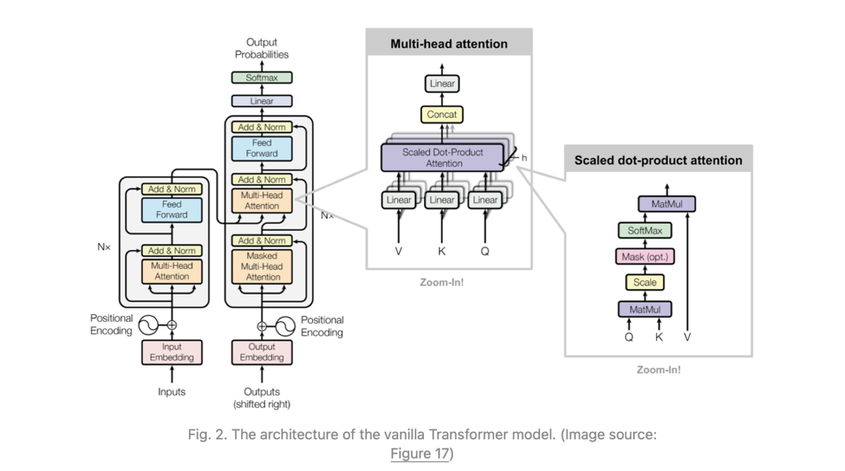
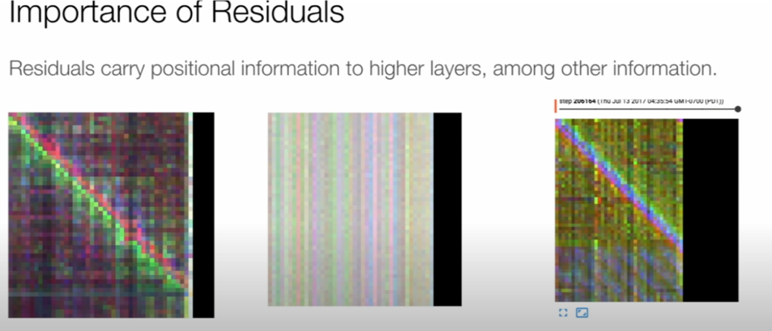

# Transformer from scracth for machinetranslation task from English to Telugu

You can find the complete torch code for transformers from scratch.

Input to transformer : Multi model transportation system was started in Hyderabad in 2003.

Actual target : హైదరాబాదు నగరంలో 2003లో మల్టీ మోడల్ రవాణా వ్యవస్థను మొదలు పెట్టారు.

Predicted target : హైదరాబాదు నగరంలో 2003లో 2003లో మోడల్ రవాణా వ్యవస్థ పెట్టు మొదలైంది.( which is pretty much similar to actual output with proper meaning)

Trained model for 20 epochs and i generated a bleu score of 0.4

Let's discuss how and transformer Models which is heart baseline for all Language Model out there in current world.

Transformer Model Mainly consist of Two parts 

1) Encoder (In the current world child of it is Bert etc.,,,,all with different architecture but core context is same)
2) Decoder ( GPT models are inspired by Decoder)

Also, Encoder have another name called AutoEncoder for pretraining 

Same Decoder is called Autoregressive Model where input is predicted based on previous output 

Alright lets jump into the core intuition behind transformer Model .

1) Encoder :

First we have gone pass the tokens to the embedding layer for which each token we assign a 512 dimension vector . Below is the code to create embedding for the input 

Reason behind passing it to embedding layer was our Machine learning models require input in a vector of continuous values.

Then we need to pass the input to position embedding layer. Why we need position embedding ? We human can understand the input sequence words on when the input comes at what position but machines cont to solve it we use Position Embedding to account word sequence.

For even ,odd position we added use sin & cos function to calculate dimension vector of size 512 

Encoder consist of mainly 2 parts 

1) Self-attention 
2) FeedForward Layers
3) Residual connections 

Let me give a reason why we need the self-attention 

Self-attention helps to represent "word" its itself by doing a weight neighbourhood and it will pass the data to feed forward network to get better features of it 

self-attention consist of three main "query","key","value" vectors which comes form WQ,WK,WV weights matrix 

we do the dot product of key & query to find the similarity between each and pass it to softmax for convex combination and divide by sqrt(dk)  its a scaling factor to make the dot product not to blow up 

Attention matrix we multiply it with value and transform into linear layer and residual connections and feed forward network 

Reason behind Multi head attention was to find the different relationship between the words and vanilla transformer it contains 8 heads and vector size of each query , key, value is 64 dimension and calculation of attention for each head was parallelized 
It was described in the paper that residual connections are not actually helped in improving accuracy, but they helped in carrying position information 

In vanilla Transformer the encoder contains 6 layers.

From the 6th layer of the encoder we have gone use the key matrix & value matrix, and it will be passed to decoder layer 

Let's go Decoder, and it's similar to Encoder layer only different was it contain masked self attention which is similar like to attention but if the value are masked those values for softmax is zero 

In order to mask the target you can do it by below code 

     def mask_target(self,target):
        batch_size , seq_lenght = target.size(0),target.size(1)

        masked_target = torch.tril(torch.ones(seq_lenght,seq_lenght)).expand(1,seq_lenght,seq_lenght)

        # return masked_target.to(DEVICE,dtype=torch.long)
        return  masked_target.to(DEVICE,dtype=torch.int64)

    def pad_mask(self,x,idx=1) :

        # This masking helps not to consider the indexes for training the padded values 

       mask=(x!=1).unsqueeze(-2)

       return mask.to(DEVICE)

One data is passed to masked self-attention only key value  & query from masked self attention is passed to Multi head attention which is normal attention.

Decoder block contain 6 decoder layers as well .

At the end of the decoder block we pass the output from last decoder to a linear to get logits and pass them to softmax to get output probabilities.

** End of the Vanilla Transformer ****